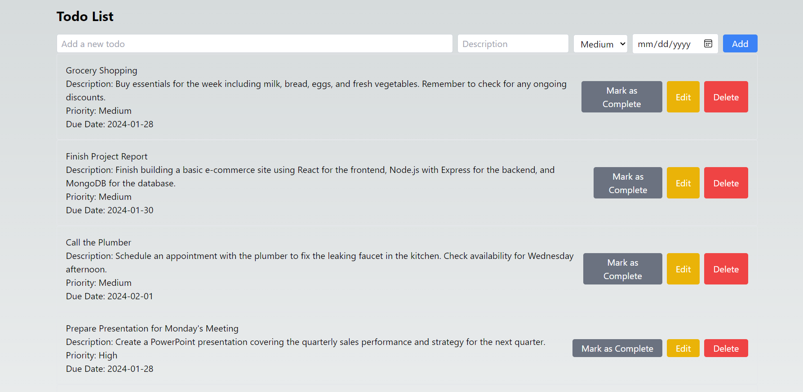
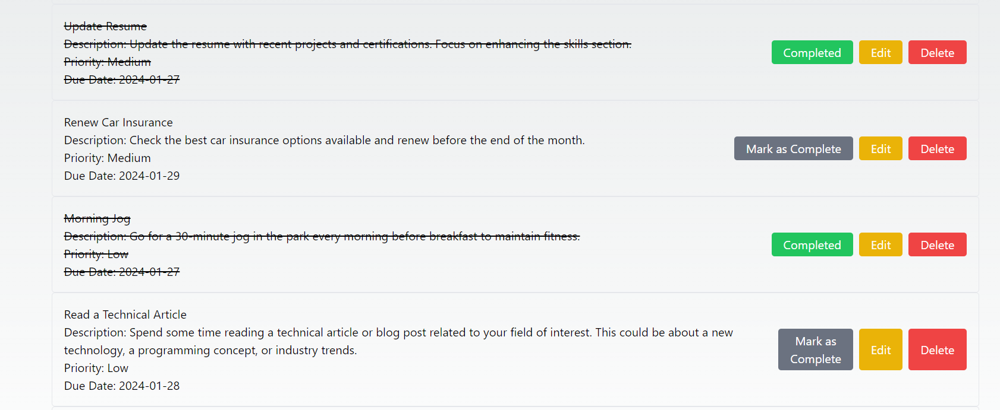

# Todo List App Backend

[](LICENSE)
[](https://github.com/blockchaincyberpunk1/todo-list-app/stargazers)
[](https://github.com/blockchaincyberpunk1/todo-list-app/network/members)
[](https://github.com/blockchaincyberpunk1/todo-list-app/issues)
[](https://github.com/blockchaincyberpunk1/todo-list-app/pulls)

## Table of Contents

- [Todo List App Backend](#todo-list-app-backend)
  - [Table of Contents](#table-of-contents)
  - [Introduction](#introduction)
  - [Demo](#demo)
  - [Technologies Used](#technologies-used)
  - [Installation](#installation)
  - [API Endpoints](#api-endpoints)
  - [Contributing](#contributing)
  - [License](#license)

## Introduction

The backend of the Todo List App serves as the core server logic for managing and storing user tasks. It provides a RESTful API to perform CRUD operations on todo items.


## Demo




You can explore a live demo of The Amazing Weather App [here](https://weatherapp.example.com).

## Technologies Used

- **Node.js**: JavaScript runtime for executing server-side code.
- **Express**: Web application framework for Node.js.
- **MongoDB**: NoSQL database for storing todo items.
- **Mongoose**: ODM (Object Document Mapper) for MongoDB and Node.js.

## Installation

To set up the backend locally, follow these steps:


1. Clone the repository:

   ```bash
   git clone https://github.com/blockchaincyberpunk1/todo-list-app

2. Navigate to the backend directory:

   ```bash
   cd server
   ```

3. Install dependencies:

   ```bash
   npm install
   ```

4. Start the server:

   ```bash
   npm start
   ```

## API Endpoints

The server provides the following endpoints:

- **GET /api/todos**: Retrieve all todos.
- **POST /api/todos**: Create a new todo.
- **PUT /api/todos/:id**: Update a todo by ID.
- **DELETE /api/todos/:id**: Delete a todo by ID.

## Contributing

CWe welcome contributions to improve the backend logic, add new features, or fix bugs. Please follow our  [Contribution Guidelines](CONTRIBUTING.md).

## License

This project is licensed under the MIT License - see the [LICENSE](LICENSE) file for details.

